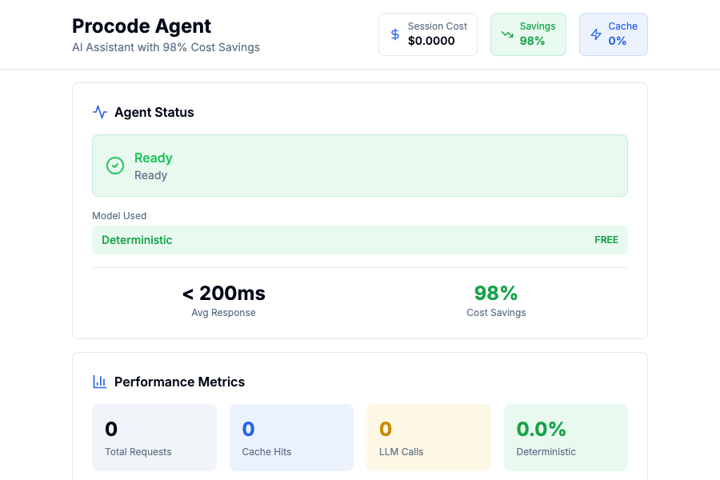

# Procode Agent Framework

**98% Cost Savings | Production-Ready | Multi-Agent System**

A comprehensive AI agent framework that solves real production challenges: intelligent cost optimization, database persistence, security guardrails, and horizontal scalability.

**Status**: Active Development | Step 10 of 25 | [View Roadmap](docs/PRODUCTION_ROADMAP.md)

---

## 🚀 Try it in 60 Seconds

**One command to run everything:**

```bash
# Clone and start with Docker
git clone https://github.com/yourusername/procode-agent-framework.git
cd procode-agent-framework
cp .env.example .env
docker-compose up -d
```

**Access the UI:**
- Frontend: http://localhost:3001
- Agent API: http://localhost:9998

**That's it!** The system works out of the box with deterministic routing. Add your `ANTHROPIC_API_KEY` to `.env` for LLM-powered intelligence.



---

## What Makes This Different

This isn't just another chatbot wrapper. It's a comprehensive framework that solves real production challenges:

- **Cost Optimization**: Reduce LLM costs by 98% through intelligent model routing
- **Database Persistence**: Full conversation and audit trail storage (SQLite/PostgreSQL)
- **Multi-LLM Strategy**: Automatically route requests to the most cost-effective model
- **Production Security**: Enhanced guardrails, PII detection, rate limiting, audit logging
- **Real-time Streaming**: Server-Sent Events for responsive user experience
- **Agent-to-Agent Communication**: Built on the A2A protocol for multi-agent workflows
- **Docker Ready**: One-command deployment with docker-compose

## Current Capabilities (Step 10/25)

### Core Features
- **Intent Classification**: LLM-based with deterministic fallback (Anthropic, OpenAI, Google)
- **Conversation Memory**: Multi-turn dialogues with context awareness
- **Database Layer**: SQLAlchemy ORM with Alembic migrations
- **Cost Tracking**: Per-message cost calculation and analytics
- **Audit Logging**: Dual persistence (files + database) for compliance
- **Streaming Responses**: Real-time SSE with progress indicators
- **Tool Integration**: GitHub Issues API with hybrid mocked/real modes

### Security & Compliance
- Input/output guardrails with PII detection
- Rate limiting and circuit breaker patterns
- Comprehensive audit trail
- GDPR compliance features

### Developer Experience
- Interactive console app with rich UI
- Streamlit and Next.js web interfaces
- Comprehensive test suite
- Makefile for common operations
- Extensive documentation

## Quick Start Options

### Option 1: Docker (Recommended - 60 seconds)

```bash
# 1. Clone and setup
git clone https://github.com/yourusername/procode-agent-framework.git
cd procode-agent-framework
cp .env.example .env

# 2. Add your API key (optional)
echo "ANTHROPIC_API_KEY=your-key-here" >> .env

# 3. Start everything
docker-compose up -d

# 4. Open your browser
open http://localhost:3001
```

**Services running:**
- Frontend UI: http://localhost:3001
- Agent API: http://localhost:9998
- PostgreSQL: localhost:5433

**Stop services:**
```bash
docker-compose down
```

### Option 2: Local Development

```bash
# Install dependencies
make install

# Start the agent server
make start

# In another terminal, run the interactive console
make console
```

The agent works out of the box with deterministic matching. Add an API key for LLM-powered intent classification.

### Option 3: Web Interface

```bash
# Streamlit (Simple)
make streamlit-app  # http://localhost:8501

# Next.js (Production-ready)
cd frontend && npm install && npm run dev  # http://localhost:3000
```

## Cost Optimization

One of the framework's key innovations is intelligent cost optimization:

| Strategy | Cost per 10K requests/day | Annual Savings |
|----------|---------------------------|----------------|
| Claude Sonnet (baseline) | $225/month | - |
| Claude Haiku | $19/month | $2,475/year |
| **Multi-LLM Strategy** | **$6/month** | **$2,628/year** |
| Ollama (local) | $0/month | $2,700/year |

The multi-LLM classifier automatically routes simple queries (greetings, basic intents) to cheaper models like Gemini Flash, while reserving GPT-4 for complex reasoning tasks.

[Read the full cost optimization strategy](docs/COST_OPTIMIZATION_SUMMARY.md)

## Architecture

```
┌─────────────────────────────────────────────────────────┐
│                    Principal Agent                       │
│  ┌──────────────────────────────────────────────────┐  │
│  │  Intent Classifier (Multi-LLM)                   │  │
│  │  - Complexity analysis                           │  │
│  │  - Model selection (Gemini/GPT-4)               │  │
│  │  - Deterministic fallback                        │  │
│  └──────────────────────────────────────────────────┘  │
│                          │                               │
│         ┌────────────────┼────────────────┐            │
│         ▼                ▼                ▼             │
│  ┌──────────┐    ┌──────────┐    ┌──────────┐        │
│  │ Tickets  │    │ Account  │    │ Payments │        │
│  │  Agent   │    │  Agent   │    │  Agent   │        │
│  └──────────┘    └──────────┘    └──────────┘        │
└─────────────────────────────────────────────────────────┘
         │                 │                 │
         ▼                 ▼                 ▼
  ┌──────────┐      ┌──────────┐     ┌──────────┐
  │ GitHub   │      │ Database │     │ Guardrails│
  │   API    │      │  Layer   │     │ & Audit   │
  └──────────┘      └──────────┘     └──────────┘
```

## Documentation

### Getting Started
- [Quick Start Guide](QUICKSTART.md) - Get up and running in 5 minutes
- [Docker Deployment](docs/DOCKER_DEPLOYMENT.md) - Containerized deployment guide
- [Console App Guide](docs/CONSOLE_APP.md) - Interactive CLI usage
- [Project Structure](docs/STRUCTURE.md) - Codebase organization

### Core Features
- [Multi-LLM Strategy](docs/MULTI_LLM_STRATEGY.md) - Cost optimization approach
- [Database Integration](docs/DATABASE_INTEGRATION.md) - Persistence layer (Step 10)
- [A2A Communication](docs/A2A_COMMUNICATION.md) - Agent-to-agent protocol

### Implementation
- [Cost Optimization Summary](docs/COST_OPTIMIZATION_SUMMARY.md) - Quick reference
- [Implementation Guide](docs/IMPLEMENTATION_GUIDE.md) - Step-by-step setup
- [Development History](docs/DEVELOPMENT_HISTORY.md) - Project evolution

### Roadmap
- [Production Roadmap](docs/PRODUCTION_ROADMAP.md) - Steps 10-25 detailed plan
- [UX Enhancement Proposal](docs/UX_ENHANCEMENT_PROPOSAL.md) - Future improvements

## Development Roadmap

We're building this framework systematically, one production feature at a time. Here's where we are:

**Phase 1: Core Infrastructure** (Steps 10-13)
- [x] Step 10: Database Integration & Persistence
- [ ] Step 11: Authentication & Authorization
- [ ] Step 12: API Rate Limiting & Throttling
- [ ] Step 13: Caching Layer (Redis)

**Phase 2: Scalability** (Steps 14-16)
- [ ] Step 14: Horizontal Scaling & Load Balancing
- [ ] Step 15: Message Queue (RabbitMQ/Kafka)
- [ ] Step 16: Monitoring & Observability

**Phase 3: Advanced AI** (Steps 17-19)
- [ ] Step 17: Vector Database & Semantic Search
- [ ] Step 18: RAG (Retrieval-Augmented Generation)
- [ ] Step 19: Fine-tuning & Model Optimization

**Phase 4: Business Features** (Steps 20-22)
- [ ] Step 20: Multi-tenancy Support
- [ ] Step 21: Billing & Usage Tracking
- [ ] Step 22: Admin Dashboard

**Phase 5: Production Readiness** (Steps 23-25)
- [ ] Step 23: CI/CD Pipeline
- [x] Step 24: Docker & Kubernetes (Docker Complete)
- [ ] Step 25: Production Deployment Guide

[View detailed roadmap with timelines](docs/PRODUCTION_ROADMAP.md)

## Docker Deployment

The framework is fully containerized with production-ready Docker setup:

```bash
# Start all services (PostgreSQL + Agent + Frontend)
docker-compose up -d

# View logs
docker logs procode-agent
docker logs procode-frontend
docker logs procode-postgres

# Run database migrations
docker exec procode-agent alembic upgrade head

# Stop services
docker-compose down

# Rebuild after code changes
docker-compose build
docker-compose up -d
```

**What's included:**
- Multi-stage Docker builds for optimization
- PostgreSQL database with health checks
- Next.js frontend with standalone output
- Non-root container users for security
- Volume persistence for data
- CORS configured for cross-origin requests

See [Docker Deployment Guide](docs/DOCKER_DEPLOYMENT.md) for advanced configuration.

## Configuration

### Environment Variables

```bash
# LLM Configuration (optional - works without)
ANTHROPIC_API_KEY=your-key
OPENAI_API_KEY=your-key
GOOGLE_API_KEY=your-key

# Database (Step 10)
DATABASE_URL=sqlite:///data/procode.db  # or PostgreSQL URL
USE_DATABASE=false  # Set to true to enable persistence

# Tool Integration (optional)
USE_REAL_TOOLS=false
GITHUB_TOKEN=your-token
GITHUB_REPO=owner/repo

# Conversation Settings
CONVERSATION_WINDOW_SIZE=10
```

See [.env.example](.env.example) for all available options.

## Testing

```bash
# Run all tests
make test-all

# Run specific test suites
make test              # Unit tests
make test-llm          # LLM integration tests
make test-streaming    # Streaming tests
make test-a2a          # Agent-to-agent tests

# Test database integration
python test_database.py

# Test cost optimization
python test_multi_llm.py
```

## API Examples

### Basic Request (JSON-RPC)

```bash
curl -X POST http://localhost:9998/ \
  -H 'Content-Type: application/json' \
  -d '{
    "jsonrpc": "2.0",
    "method": "message/send",
    "params": {
      "message": {
        "role": "user",
        "parts": [{"kind": "text", "text": "Create a support ticket"}],
        "messageId": "msg-001"
      }
    },
    "id": 1
  }'
```

### Streaming Request (SSE)

```bash
curl -N -X POST http://localhost:9998/stream \
  -H 'Content-Type: application/json' \
  -d '{
    "message": {
      "role": "user",
      "parts": [{"kind": "text", "text": "I need help with my account"}]
    }
  }'
```

## Web Interfaces

### Streamlit (Simple, Working)
```bash
make streamlit-app
```
Access at http://localhost:8501

### Next.js (Modern, Production-Ready)
```bash
cd frontend
npm install
npm run dev
```
Access at http://localhost:3000

## Project Structure

```
procode-agent-framework/
├── core/                    # Core agent functionality
│   ├── agent_router.py     # Main routing logic
│   ├── intent_classifier.py # LLM-based classification
│   ├── multi_llm_classifier.py # Cost-optimized routing
│   └── conversation_memory.py # Multi-turn support
├── database/               # Database layer (Step 10)
│   ├── models.py          # SQLAlchemy models
│   ├── connection.py      # Database connection
│   └── repositories/      # Data access layer
├── security/              # Security & compliance
│   ├── enhanced_guardrails.py # PII detection
│   ├── audit_logger.py    # Audit trail
│   └── rate_limiter.py    # Rate limiting
├── tasks/                 # Task-specific agents
│   ├── task_tickets.py   # Support tickets
│   ├── task_account.py   # Account management
│   └── task_payments.py  # Payment operations
├── frontend/             # Next.js web interface
├── docs/                 # Comprehensive documentation
└── tests/                # Test suite
```

## Contributing

This is an active learning project demonstrating production-ready AI agent development. While not currently accepting external contributions, feel free to:

- Star the repo to follow progress
- Open issues for questions or suggestions
- Fork for your own experiments
- Check back regularly for new features (we're at Step 10 of 25!)

## Technology Stack

- **Framework**: A2A SDK (Agent-to-Agent protocol)
- **LLM Providers**: Anthropic Claude, OpenAI GPT, Google Gemini
- **Database**: SQLAlchemy (SQLite/PostgreSQL)
- **Migrations**: Alembic
- **Web**: Starlette, FastAPI, Next.js, Streamlit
- **Testing**: pytest, unittest
- **Tools**: GitHub API, Rich (CLI), CopilotKit

## License

[MIT License](LICENSE) - See LICENSE file for details.

Copyright (c) 2026 Jimmy Harjadi

## What's Next?

**Step 11: Authentication & Authorization** is coming next, featuring:
- User registration and login
- JWT token generation
- API key authentication
- Role-based access control (RBAC)
- Session management

The database models are already in place. Follow the repo to see it implemented!

---

**Built with expertise in**: AI/ML Engineering, Solution Architecture, Production Systems, Cost Optimization, Security & Compliance

**Questions?** Check the [documentation](docs/) or review the [development history](docs/DEVELOPMENT_HISTORY.md) for context.
