# Step 11: Authentication & Authorization - Sequence Diagrams

This document contains detailed sequence diagrams for all authentication and authorization flows in the ProCode Agent Framework.

## Table of Contents
1. [User Registration Flow](#1-user-registration-flow)
2. [User Login Flow](#2-user-login-flow)
3. [Protected API Request Flow](#3-protected-api-request-flow)
4. [Token Refresh Flow](#4-token-refresh-flow)
5. [Permission Check Flow](#5-permission-check-flow)
6. [User Logout Flow](#6-user-logout-flow)
7. [Failed Login with Account Lockout](#7-failed-login-with-account-lockout)
8. [Admin Role Assignment Flow](#8-admin-role-assignment-flow)

---

## 1. User Registration Flow

### Happy Path: Successful Registration

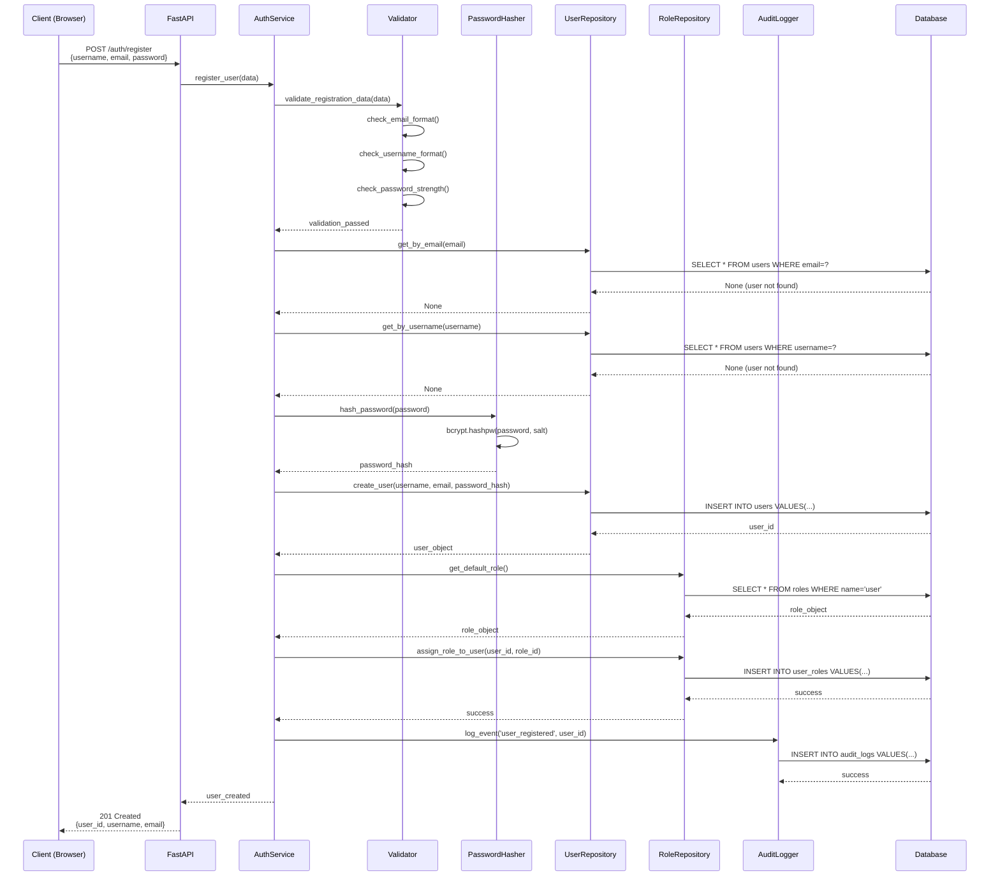
```mermaid
sequenceDiagram
    participant C as Client (Browser)
    participant F as FastAPI
    participant A as AuthService
    participant V as Validator
    participant P as PasswordHasher
    participant U as UserRepository
    participant R as RoleRepository
    participant L as AuditLogger
    participant D as Database

    C->>F: POST /auth/register<br/>{username, email, password}
    F->>A: register_user(data)
    
    A->>V: validate_registration_data(data)
    V->>V: check_email_format()
    V->>V: check_username_format()
    V->>V: check_password_strength()
    V-->>A: validation_passed
    
    A->>U: get_by_email(email)
    U->>D: SELECT * FROM users WHERE email=?
    D-->>U: None (user not found)
    U-->>A: None
    
    A->>U: get_by_username(username)
    U->>D: SELECT * FROM users WHERE username=?
    D-->>U: None (user not found)
    U-->>A: None
    
    A->>P: hash_password(password)
    P->>P: bcrypt.hashpw(password, salt)
    P-->>A: password_hash
    
    A->>U: create_user(username, email, password_hash)
    U->>D: INSERT INTO users VALUES(...)
    D-->>U: user_id
    U-->>A: user_object
    
    A->>R: get_default_role()
    R->>D: SELECT * FROM roles WHERE name='user'
    D-->>R: role_object
    R-->>A: role_object
    
    A->>R: assign_role_to_user(user_id, role_id)
    R->>D: INSERT INTO user_roles VALUES(...)
    D-->>R: success
    R-->>A: success
    
    A->>L: log_event('user_registered', user_id)
    L->>D: INSERT INTO audit_logs VALUES(...)
    D-->>L: success
    
    A-->>F: user_created
    F-->>C: 201 Created<br/>{user_id, username, email}
```

### Error Path: Email Already Exists

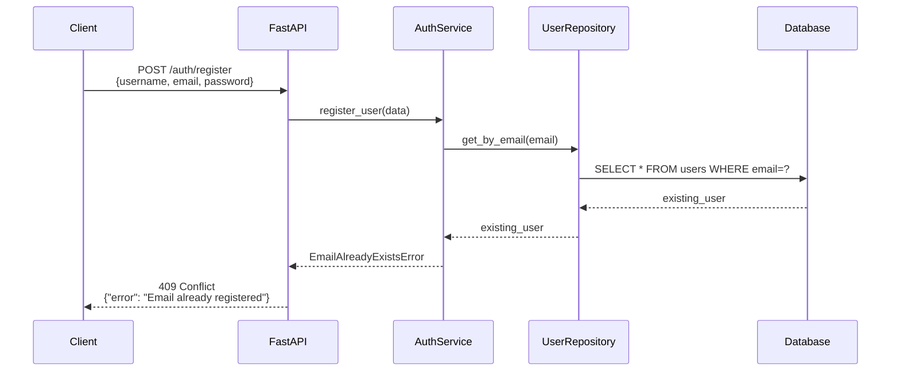
```mermaid
sequenceDiagram
    participant C as Client
    participant F as FastAPI
    participant A as AuthService
    participant U as UserRepository
    participant D as Database

    C->>F: POST /auth/register<br/>{username, email, password}
    F->>A: register_user(data)
    
    A->>U: get_by_email(email)
    U->>D: SELECT * FROM users WHERE email=?
    D-->>U: existing_user
    U-->>A: existing_user
    
    A-->>F: EmailAlreadyExistsError
    F-->>C: 409 Conflict<br/>{"error": "Email already registered"}
```

---

## 2. User Login Flow

### Happy Path: Successful Login

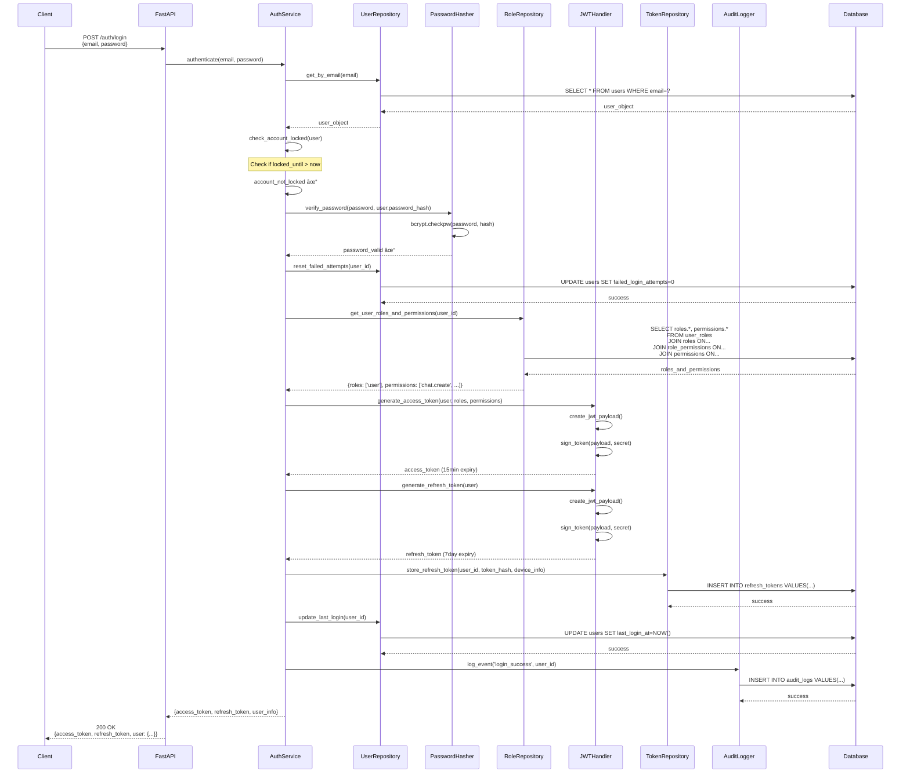
```mermaid
sequenceDiagram
    participant C as Client
    participant F as FastAPI
    participant A as AuthService
    participant U as UserRepository
    participant P as PasswordHasher
    participant R as RoleRepository
    participant J as JWTHandler
    participant T as TokenRepository
    participant L as AuditLogger
    participant D as Database

    C->>F: POST /auth/login<br/>{email, password}
    F->>A: authenticate(email, password)
    
    A->>U: get_by_email(email)
    U->>D: SELECT * FROM users WHERE email=?
    D-->>U: user_object
    U-->>A: user_object
    
    A->>A: check_account_locked(user)
    Note over A: Check if locked_until > now
    A->>A: account_not_locked ✓
    
    A->>P: verify_password(password, user.password_hash)
    P->>P: bcrypt.checkpw(password, hash)
    P-->>A: password_valid ✓
    
    A->>U: reset_failed_attempts(user_id)
    U->>D: UPDATE users SET failed_login_attempts=0
    D-->>U: success
    
    A->>R: get_user_roles_and_permissions(user_id)
    R->>D: SELECT roles.*, permissions.*<br/>FROM user_roles<br/>JOIN roles ON...<br/>JOIN role_permissions ON...<br/>JOIN permissions ON...
    D-->>R: roles_and_permissions
    R-->>A: {roles: ['user'], permissions: ['chat.create', ...]}
    
    A->>J: generate_access_token(user, roles, permissions)
    J->>J: create_jwt_payload()
    J->>J: sign_token(payload, secret)
    J-->>A: access_token (15min expiry)
    
    A->>J: generate_refresh_token(user)
    J->>J: create_jwt_payload()
    J->>J: sign_token(payload, secret)
    J-->>A: refresh_token (7day expiry)
    
    A->>T: store_refresh_token(user_id, token_hash, device_info)
    T->>D: INSERT INTO refresh_tokens VALUES(...)
    D-->>T: success
    
    A->>U: update_last_login(user_id)
    U->>D: UPDATE users SET last_login_at=NOW()
    D-->>U: success
    
    A->>L: log_event('login_success', user_id)
    L->>D: INSERT INTO audit_logs VALUES(...)
    D-->>L: success
    
    A-->>F: {access_token, refresh_token, user_info}
    F-->>C: 200 OK<br/>{access_token, refresh_token, user: {...}}
```

### Error Path: Invalid Password with Account Lockout

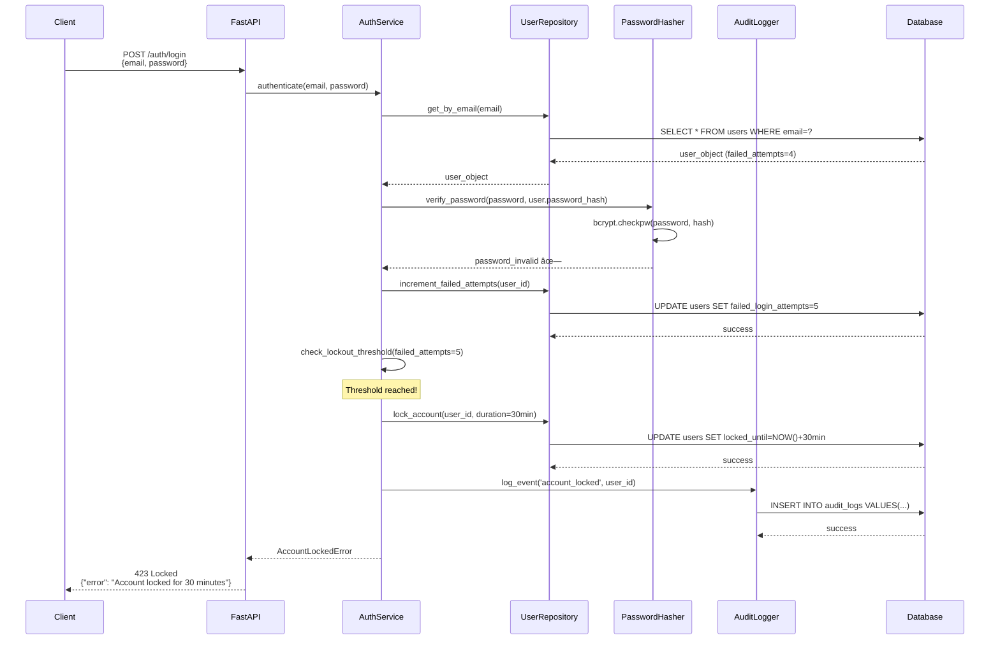
```mermaid
sequenceDiagram
    participant C as Client
    participant F as FastAPI
    participant A as AuthService
    participant U as UserRepository
    participant P as PasswordHasher
    participant L as AuditLogger
    participant D as Database

    C->>F: POST /auth/login<br/>{email, password}
    F->>A: authenticate(email, password)
    
    A->>U: get_by_email(email)
    U->>D: SELECT * FROM users WHERE email=?
    D-->>U: user_object (failed_attempts=4)
    U-->>A: user_object
    
    A->>P: verify_password(password, user.password_hash)
    P->>P: bcrypt.checkpw(password, hash)
    P-->>A: password_invalid ✗
    
    A->>U: increment_failed_attempts(user_id)
    U->>D: UPDATE users SET failed_login_attempts=5
    D-->>U: success
    
    A->>A: check_lockout_threshold(failed_attempts=5)
    Note over A: Threshold reached!
    
    A->>U: lock_account(user_id, duration=30min)
    U->>D: UPDATE users SET locked_until=NOW()+30min
    D-->>U: success
    
    A->>L: log_event('account_locked', user_id)
    L->>D: INSERT INTO audit_logs VALUES(...)
    D-->>L: success
    
    A-->>F: AccountLockedError
    F-->>C: 423 Locked<br/>{"error": "Account locked for 30 minutes"}
```

---

## 3. Protected API Request Flow

### Happy Path: Authorized Request

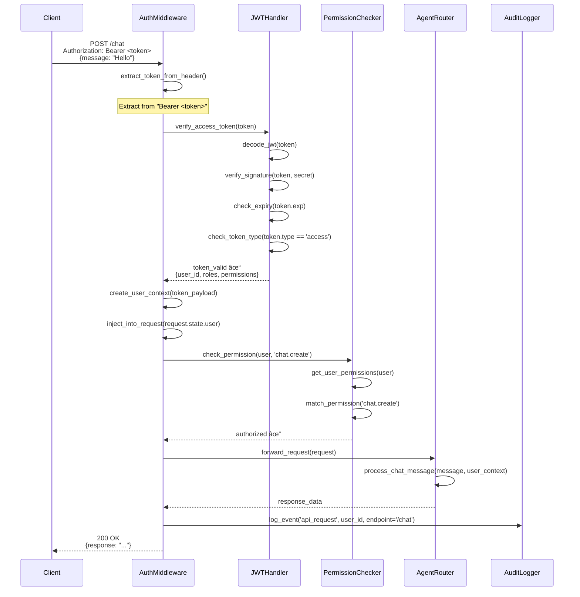
```mermaid
sequenceDiagram
    participant C as Client
    participant M as AuthMiddleware
    participant J as JWTHandler
    participant P as PermissionChecker
    participant R as AgentRouter
    participant L as AuditLogger

    C->>M: POST /chat<br/>Authorization: Bearer <token><br/>{message: "Hello"}
    
    M->>M: extract_token_from_header()
    Note over M: Extract from "Bearer <token>"
    
    M->>J: verify_access_token(token)
    J->>J: decode_jwt(token)
    J->>J: verify_signature(token, secret)
    J->>J: check_expiry(token.exp)
    J->>J: check_token_type(token.type == 'access')
    J-->>M: token_valid ✓<br/>{user_id, roles, permissions}
    
    M->>M: create_user_context(token_payload)
    M->>M: inject_into_request(request.state.user)
    
    M->>P: check_permission(user, 'chat.create')
    P->>P: get_user_permissions(user)
    P->>P: match_permission('chat.create')
    P-->>M: authorized ✓
    
    M->>R: forward_request(request)
    R->>R: process_chat_message(message, user_context)
    R-->>M: response_data
    
    M->>L: log_event('api_request', user_id, endpoint='/chat')
    
    M-->>C: 200 OK<br/>{response: "..."}
```

### Error Path: Expired Token

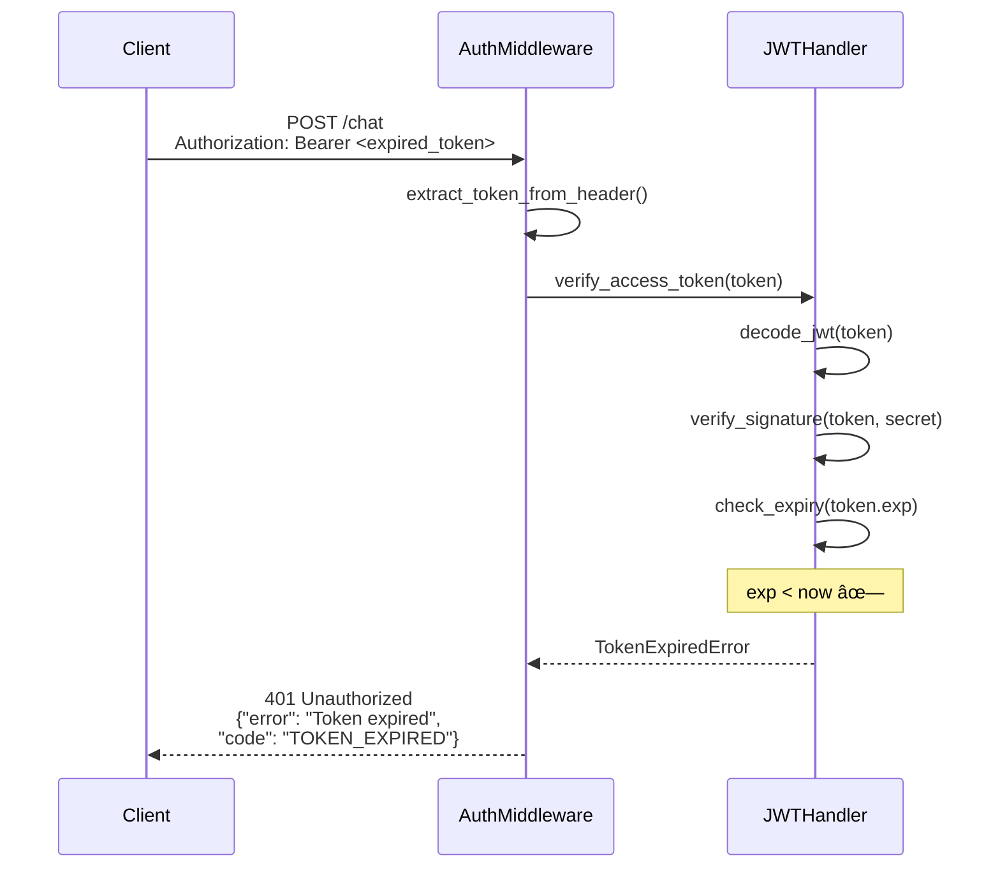
```mermaid
sequenceDiagram
    participant C as Client
    participant M as AuthMiddleware
    participant J as JWTHandler

    C->>M: POST /chat<br/>Authorization: Bearer <expired_token>
    
    M->>M: extract_token_from_header()
    
    M->>J: verify_access_token(token)
    J->>J: decode_jwt(token)
    J->>J: verify_signature(token, secret)
    J->>J: check_expiry(token.exp)
    Note over J: exp < now ✗
    J-->>M: TokenExpiredError
    
    M-->>C: 401 Unauthorized<br/>{"error": "Token expired",<br/>"code": "TOKEN_EXPIRED"}
```

### Error Path: Insufficient Permissions

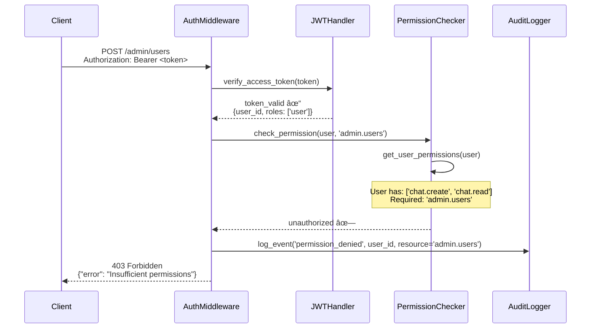
```mermaid
sequenceDiagram
    participant C as Client
    participant M as AuthMiddleware
    participant J as JWTHandler
    participant P as PermissionChecker
    participant L as AuditLogger

    C->>M: POST /admin/users<br/>Authorization: Bearer <token>
    
    M->>J: verify_access_token(token)
    J-->>M: token_valid ✓<br/>{user_id, roles: ['user']}
    
    M->>P: check_permission(user, 'admin.users')
    P->>P: get_user_permissions(user)
    Note over P: User has: ['chat.create', 'chat.read']<br/>Required: 'admin.users'
    P-->>M: unauthorized ✗
    
    M->>L: log_event('permission_denied', user_id, resource='admin.users')
    
    M-->>C: 403 Forbidden<br/>{"error": "Insufficient permissions"}
```

---

## 4. Token Refresh Flow

### Happy Path: Successful Token Refresh

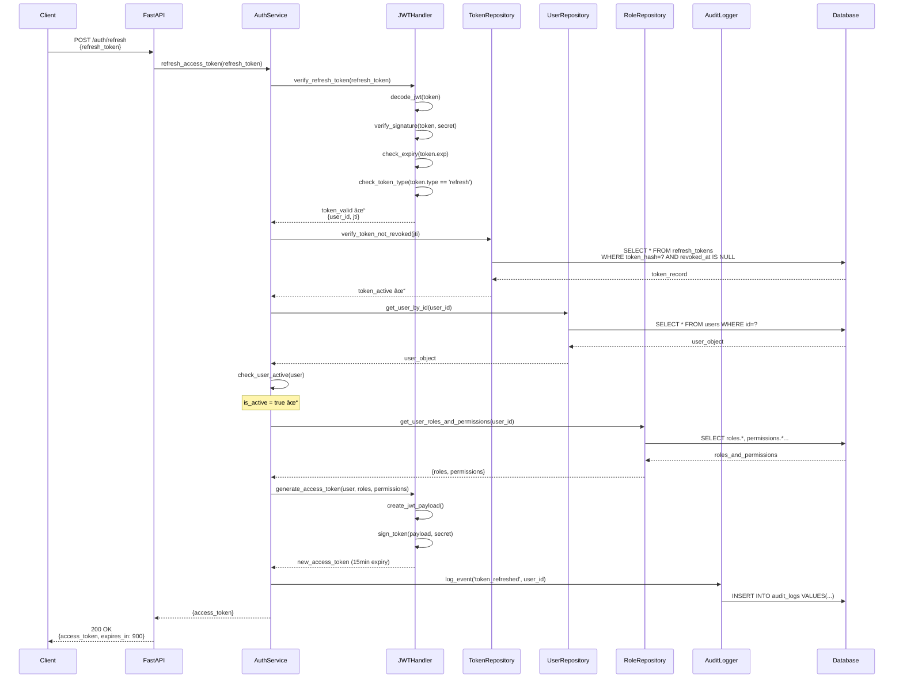
```mermaid
sequenceDiagram
    participant C as Client
    participant F as FastAPI
    participant A as AuthService
    participant J as JWTHandler
    participant T as TokenRepository
    participant U as UserRepository
    participant R as RoleRepository
    participant L as AuditLogger
    participant D as Database

    C->>F: POST /auth/refresh<br/>{refresh_token}
    F->>A: refresh_access_token(refresh_token)
    
    A->>J: verify_refresh_token(refresh_token)
    J->>J: decode_jwt(token)
    J->>J: verify_signature(token, secret)
    J->>J: check_expiry(token.exp)
    J->>J: check_token_type(token.type == 'refresh')
    J-->>A: token_valid ✓<br/>{user_id, jti}
    
    A->>T: verify_token_not_revoked(jti)
    T->>D: SELECT * FROM refresh_tokens<br/>WHERE token_hash=? AND revoked_at IS NULL
    D-->>T: token_record
    T-->>A: token_active ✓
    
    A->>U: get_user_by_id(user_id)
    U->>D: SELECT * FROM users WHERE id=?
    D-->>U: user_object
    U-->>A: user_object
    
    A->>A: check_user_active(user)
    Note over A: is_active = true ✓
    
    A->>R: get_user_roles_and_permissions(user_id)
    R->>D: SELECT roles.*, permissions.*...
    D-->>R: roles_and_permissions
    R-->>A: {roles, permissions}
    
    A->>J: generate_access_token(user, roles, permissions)
    J->>J: create_jwt_payload()
    J->>J: sign_token(payload, secret)
    J-->>A: new_access_token (15min expiry)
    
    A->>L: log_event('token_refreshed', user_id)
    L->>D: INSERT INTO audit_logs VALUES(...)
    
    A-->>F: {access_token}
    F-->>C: 200 OK<br/>{access_token, expires_in: 900}
```

### Error Path: Revoked Refresh Token

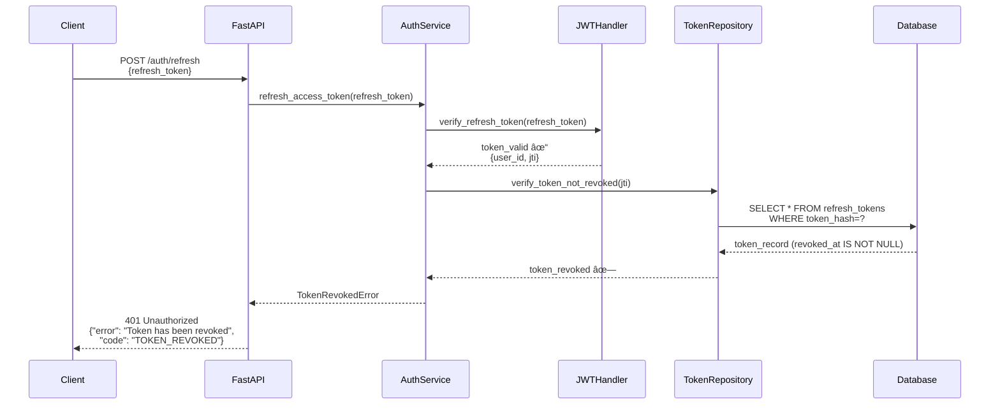
```mermaid
sequenceDiagram
    participant C as Client
    participant F as FastAPI
    participant A as AuthService
    participant J as JWTHandler
    participant T as TokenRepository
    participant D as Database

    C->>F: POST /auth/refresh<br/>{refresh_token}
    F->>A: refresh_access_token(refresh_token)
    
    A->>J: verify_refresh_token(refresh_token)
    J-->>A: token_valid ✓<br/>{user_id, jti}
    
    A->>T: verify_token_not_revoked(jti)
    T->>D: SELECT * FROM refresh_tokens<br/>WHERE token_hash=?
    D-->>T: token_record (revoked_at IS NOT NULL)
    T-->>A: token_revoked ✗
    
    A-->>F: TokenRevokedError
    F-->>C: 401 Unauthorized<br/>{"error": "Token has been revoked",<br/>"code": "TOKEN_REVOKED"}
```

---

## 5. Permission Check Flow

### Detailed Permission Resolution

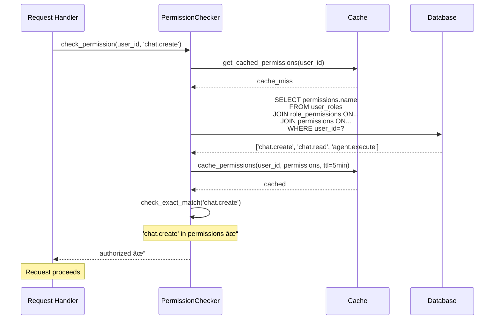
```mermaid
sequenceDiagram
    participant R as Request Handler
    participant P as PermissionChecker
    participant C as Cache
    participant D as Database

    R->>P: check_permission(user_id, 'chat.create')
    
    P->>C: get_cached_permissions(user_id)
    C-->>P: cache_miss
    
    P->>D: SELECT permissions.name<br/>FROM user_roles<br/>JOIN role_permissions ON...<br/>JOIN permissions ON...<br/>WHERE user_id=?
    D-->>P: ['chat.create', 'chat.read', 'agent.execute']
    
    P->>C: cache_permissions(user_id, permissions, ttl=5min)
    C-->>P: cached
    
    P->>P: check_exact_match('chat.create')
    Note over P: 'chat.create' in permissions ✓
    P-->>R: authorized ✓
    
    Note over R: Request proceeds
```

### Wildcard Permission Check

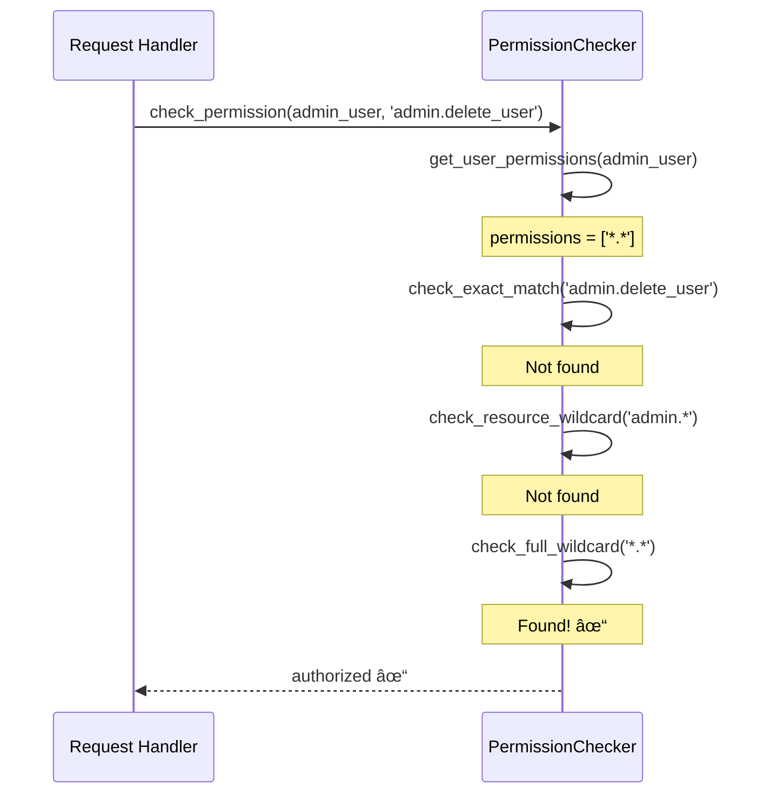
```mermaid
sequenceDiagram
    participant R as Request Handler
    participant P as PermissionChecker

    R->>P: check_permission(admin_user, 'admin.delete_user')
    
    P->>P: get_user_permissions(admin_user)
    Note over P: permissions = ['*.*']
    
    P->>P: check_exact_match('admin.delete_user')
    Note over P: Not found
    
    P->>P: check_resource_wildcard('admin.*')
    Note over P: Not found
    
    P->>P: check_full_wildcard('*.*')
    Note over P: Found! ✓
    
    P-->>R: authorized ✓
```

---

## 6. User Logout Flow

### Complete Logout with Token Revocation

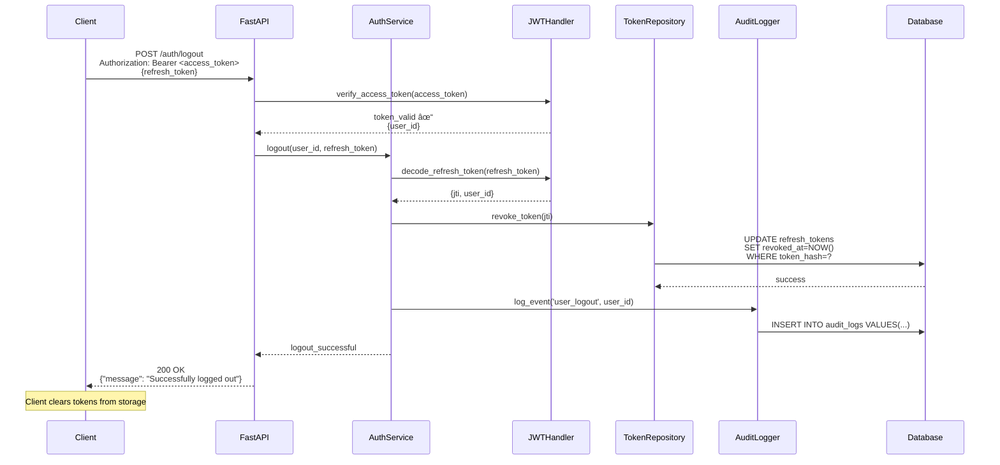
```mermaid
sequenceDiagram
    participant C as Client
    participant F as FastAPI
    participant A as AuthService
    participant J as JWTHandler
    participant T as TokenRepository
    participant L as AuditLogger
    participant D as Database

    C->>F: POST /auth/logout<br/>Authorization: Bearer <access_token><br/>{refresh_token}
    
    F->>J: verify_access_token(access_token)
    J-->>F: token_valid ✓<br/>{user_id}
    
    F->>A: logout(user_id, refresh_token)
    
    A->>J: decode_refresh_token(refresh_token)
    J-->>A: {jti, user_id}
    
    A->>T: revoke_token(jti)
    T->>D: UPDATE refresh_tokens<br/>SET revoked_at=NOW()<br/>WHERE token_hash=?
    D-->>T: success
    
    A->>L: log_event('user_logout', user_id)
    L->>D: INSERT INTO audit_logs VALUES(...)
    
    A-->>F: logout_successful
    F-->>C: 200 OK<br/>{"message": "Successfully logged out"}
    
    Note over C: Client clears tokens from storage
```

---

## 7. Failed Login with Account Lockout

### Progressive Failure Tracking

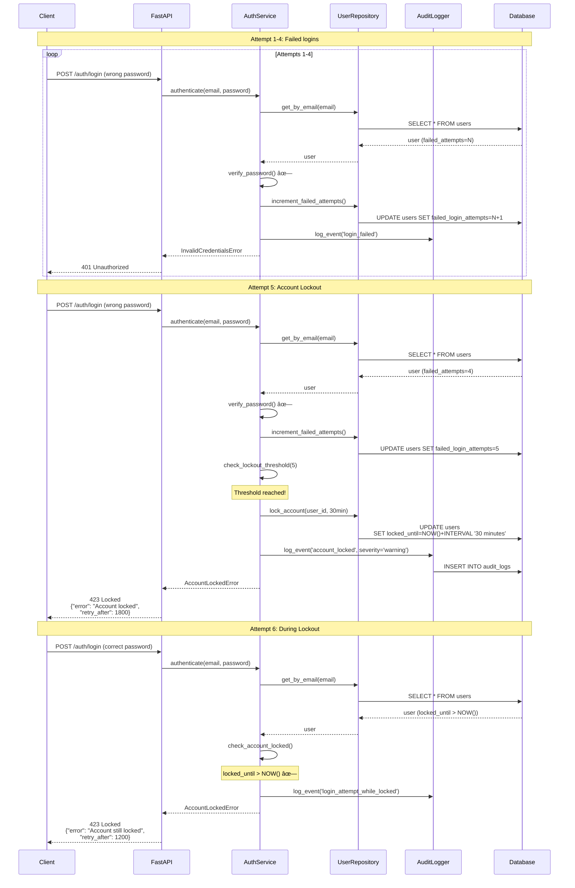
```mermaid
sequenceDiagram
    participant C as Client
    participant F as FastAPI
    participant A as AuthService
    participant U as UserRepository
    participant L as AuditLogger
    participant D as Database

    Note over C,D: Attempt 1-4: Failed logins
    
    loop Attempts 1-4
        C->>F: POST /auth/login (wrong password)
        F->>A: authenticate(email, password)
        A->>U: get_by_email(email)
        U->>D: SELECT * FROM users
        D-->>U: user (failed_attempts=N)
        U-->>A: user
        A->>A: verify_password() ✗
        A->>U: increment_failed_attempts()
        U->>D: UPDATE users SET failed_login_attempts=N+1
        A->>L: log_event('login_failed')
        A-->>F: InvalidCredentialsError
        F-->>C: 401 Unauthorized
    end
    
    Note over C,D: Attempt 5: Account Lockout
    
    C->>F: POST /auth/login (wrong password)
    F->>A: authenticate(email, password)
    A->>U: get_by_email(email)
    U->>D: SELECT * FROM users
    D-->>U: user (failed_attempts=4)
    U-->>A: user
    A->>A: verify_password() ✗
    A->>U: increment_failed_attempts()
    U->>D: UPDATE users SET failed_login_attempts=5
    
    A->>A: check_lockout_threshold(5)
    Note over A: Threshold reached!
    
    A->>U: lock_account(user_id, 30min)
    U->>D: UPDATE users<br/>SET locked_until=NOW()+INTERVAL '30 minutes'
    
    A->>L: log_event('account_locked', severity='warning')
    L->>D: INSERT INTO audit_logs
    
    A-->>F: AccountLockedError
    F-->>C: 423 Locked<br/>{"error": "Account locked",<br/>"retry_after": 1800}
    
    Note over C,D: Attempt 6: During Lockout
    
    C->>F: POST /auth/login (correct password)
    F->>A: authenticate(email, password)
    A->>U: get_by_email(email)
    U->>D: SELECT * FROM users
    D-->>U: user (locked_until > NOW())
    U-->>A: user
    
    A->>A: check_account_locked()
    Note over A: locked_until > NOW() ✗
    
    A->>L: log_event('login_attempt_while_locked')
    
    A-->>F: AccountLockedError
    F-->>C: 423 Locked<br/>{"error": "Account still locked",<br/>"retry_after": 1200}
```

---

## 8. Admin Role Assignment Flow

### Assigning Role to User

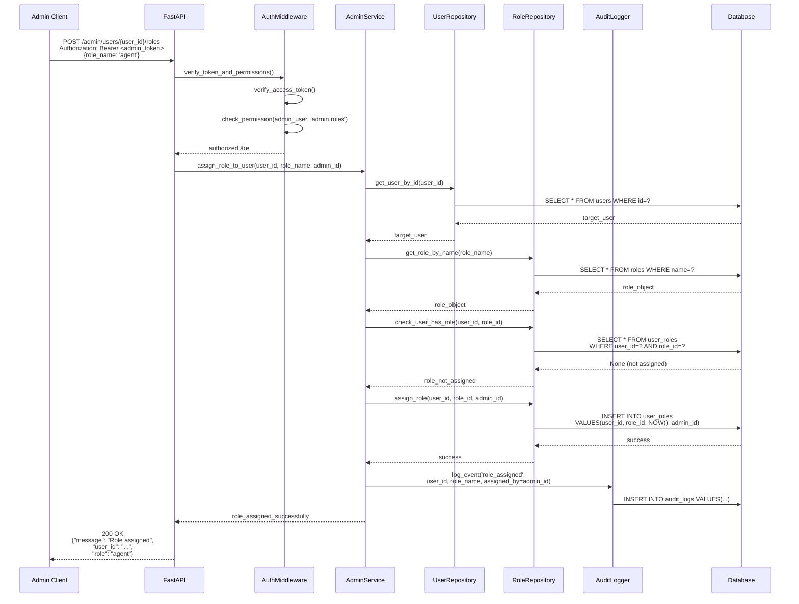
```mermaid
sequenceDiagram
    participant A as Admin Client
    participant F as FastAPI
    participant M as AuthMiddleware
    participant S as AdminService
    participant U as UserRepository
    participant R as RoleRepository
    participant L as AuditLogger
    participant D as Database

    A->>F: POST /admin/users/{user_id}/roles<br/>Authorization: Bearer <admin_token><br/>{role_name: 'agent'}
    
    F->>M: verify_token_and_permissions()
    M->>M: verify_access_token()
    M->>M: check_permission(admin_user, 'admin.roles')
    M-->>F: authorized ✓
    
    F->>S: assign_role_to_user(user_id, role_name, admin_id)
    
    S->>U: get_user_by_id(user_id)
    U->>D: SELECT * FROM users WHERE id=?
    D-->>U: target_user
    U-->>S: target_user
    
    S->>R: get_role_by_name(role_name)
    R->>D: SELECT * FROM roles WHERE name=?
    D-->>R: role_object
    R-->>S: role_object
    
    S->>R: check_user_has_role(user_id, role_id)
    R->>D: SELECT * FROM user_roles<br/>WHERE user_id=? AND role_id=?
    D-->>R: None (not assigned)
    R-->>S: role_not_assigned
    
    S->>R: assign_role(user_id, role_id, admin_id)
    R->>D: INSERT INTO user_roles<br/>VALUES(user_id, role_id, NOW(), admin_id)
    D-->>R: success
    R-->>S: success
    
    S->>L: log_event('role_assigned',<br/>user_id, role_name, assigned_by=admin_id)
    L->>D: INSERT INTO audit_logs VALUES(...)
    
    S-->>F: role_assigned_successfully
    F-->>A: 200 OK<br/>{"message": "Role assigned",<br/>"user_id": "...",<br/>"role": "agent"}
```

---

## 9. Multi-Device Session Management

### User with Multiple Active Sessions

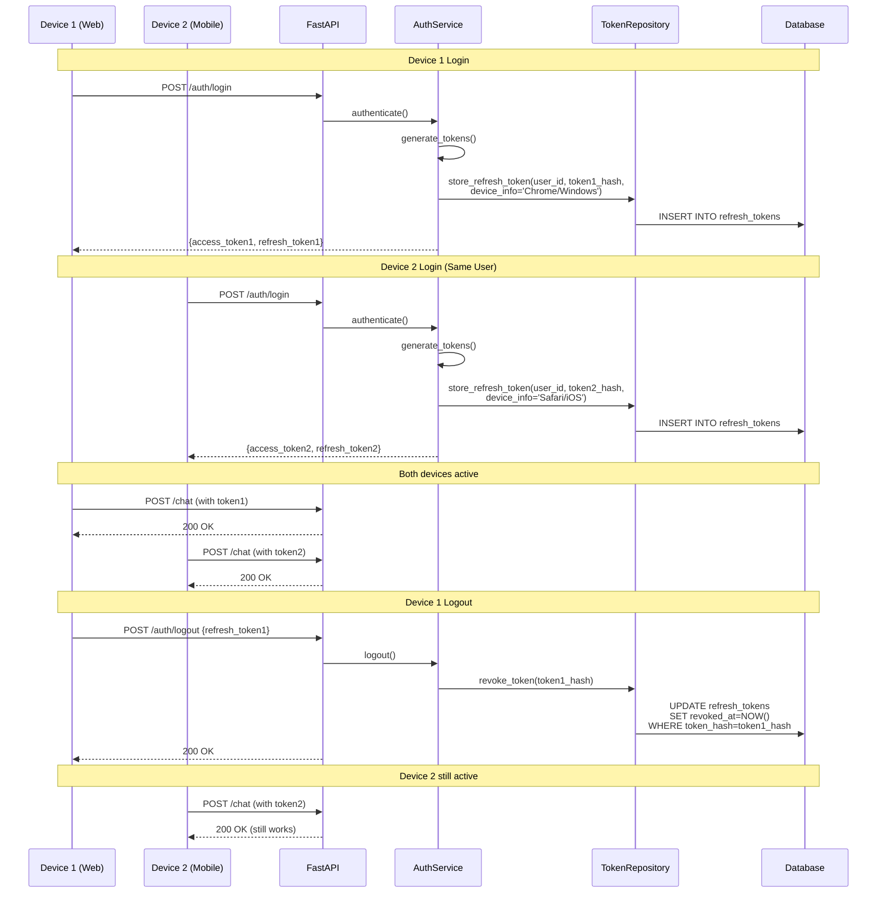
```mermaid
sequenceDiagram
    participant D1 as Device 1 (Web)
    participant D2 as Device 2 (Mobile)
    participant F as FastAPI
    participant A as AuthService
    participant T as TokenRepository
    participant DB as Database

    Note over D1,DB: Device 1 Login
    
    D1->>F: POST /auth/login
    F->>A: authenticate()
    A->>A: generate_tokens()
    A->>T: store_refresh_token(user_id, token1_hash,<br/>device_info='Chrome/Windows')
    T->>DB: INSERT INTO refresh_tokens
    A-->>D1: {access_token1, refresh_token1}
    
    Note over D1,DB: Device 2 Login (Same User)
    
    D2->>F: POST /auth/login
    F->>A: authenticate()
    A->>A: generate_tokens()
    A->>T: store_refresh_token(user_id, token2_hash,<br/>device_info='Safari/iOS')
    T->>DB: INSERT INTO refresh_tokens
    A-->>D2: {access_token2, refresh_token2}
    
    Note over D1,DB: Both devices active
    
    D1->>F: POST /chat (with token1)
    F-->>D1: 200 OK
    
    D2->>F: POST /chat (with token2)
    F-->>D2: 200 OK
    
    Note over D1,DB: Device 1 Logout
    
    D1->>F: POST /auth/logout {refresh_token1}
    F->>A: logout()
    A->>T: revoke_token(token1_hash)
    T->>DB: UPDATE refresh_tokens<br/>SET revoked_at=NOW()<br/>WHERE token_hash=token1_hash
    F-->>D1: 200 OK
    
    Note over D1,DB: Device 2 still active
    
    D2->>F: POST /chat (with token2)
    F-->>D2: 200 OK (still works)
```

---

## 10. Error Handling Summary

### Common Error Responses

| Status Code | Error Code | Description | Retry Strategy |
|-------------|------------|-------------|----------------|
| 400 | INVALID_INPUT | Validation failed | Fix input, retry |
| 401 | TOKEN_EXPIRED | Access token expired | Refresh token, retry |
| 401 | TOKEN_INVALID | Token signature invalid | Re-login |
| 401 | TOKEN_REVOKED | Refresh token revoked | Re-login |
| 401 | INVALID_CREDENTIALS | Wrong email/password | Check credentials |
| 403 | INSUFFICIENT_PERMISSIONS | Missing required permission | Request access |
| 409 | EMAIL_EXISTS | Email already registered | Use different email |
| 409 | USERNAME_EXISTS | Username already taken | Use different username |
| 423 | ACCOUNT_LOCKED | Too many failed attempts | Wait for lockout period |
| 429 | RATE_LIMIT_EXCEEDED | Too many requests | Exponential backoff |

---

## 11. Integration with Existing System

### Agent Execution with User Context

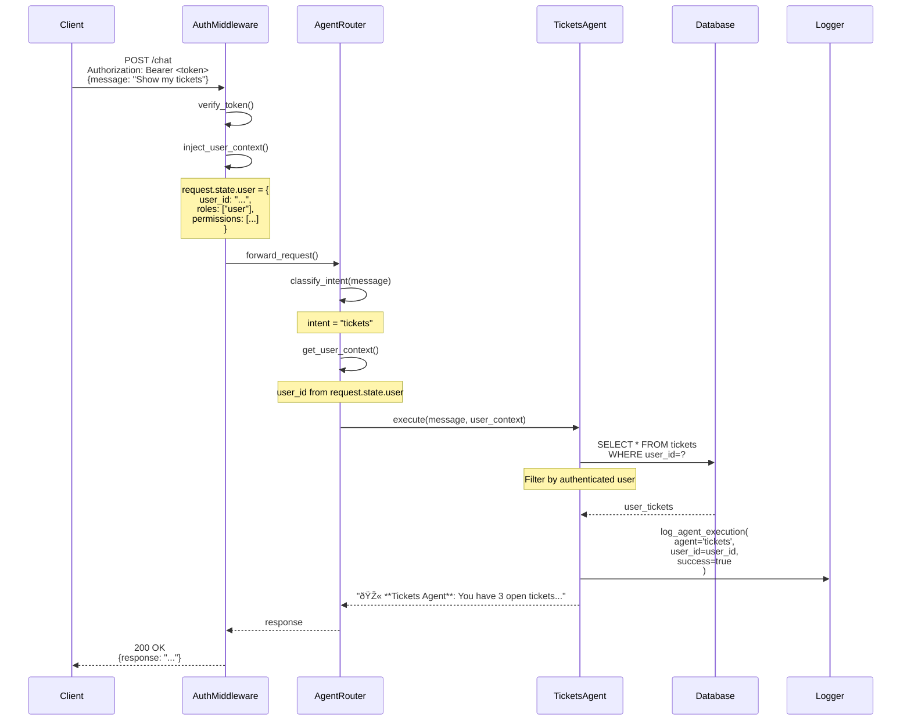
```mermaid
sequenceDiagram
    participant C as Client
    participant M as AuthMiddleware
    participant R as AgentRouter
    participant T as TicketsAgent
    participant DB as Database
    participant L as Logger

    C->>M: POST /chat<br/>Authorization: Bearer <token><br/>{message: "Show my tickets"}
    
    M->>M: verify_token()
    M->>M: inject_user_context()
    Note over M: request.state.user = {<br/>  user_id: "...",<br/>  roles: ["user"],<br/>  permissions: [...]<br/>}
    
    M->>R: forward_request()
    
    R->>R: classify_intent(message)
    Note over R: intent = "tickets"
    
    R->>R: get_user_context()
    Note over R: user_id from request.state.user
    
    R->>T: execute(message, user_context)
    
    T->>DB: SELECT * FROM tickets<br/>WHERE user_id=?
    Note over T: Filter by authenticated user
    DB-->>T: user_tickets
    
    T->>L: log_agent_execution(<br/>  agent='tickets',<br/>  user_id=user_id,<br/>  success=true<br/>)
    
    T-->>R: "🎫 **Tickets Agent**: You have 3 open tickets..."
    R-->>M: response
    M-->>C: 200 OK<br/>{response: "..."}
```

---

## Document Information

**Version**: 1.0  
**Last Updated**: 2026-01-27  
**Format**: Mermaid Sequence Diagrams  
**Status**: Ready for Review

### Diagram Legend

- **Solid arrows (→)**: Synchronous calls
- **Dashed arrows (-->)**: Return values
- **Note boxes**: Important logic or state
- **Loop boxes**: Repeated operations
- **Alt boxes**: Conditional branches

### Tools for Viewing

These diagrams use Mermaid syntax and can be viewed in:
- GitHub (native support)
- VS Code (with Mermaid extension)
- Online: https://mermaid.live/
- Documentation sites (GitBook, Docusaurus, etc.)

---

**Next Steps**: Review these diagrams with the team and proceed with implementation once approved.
